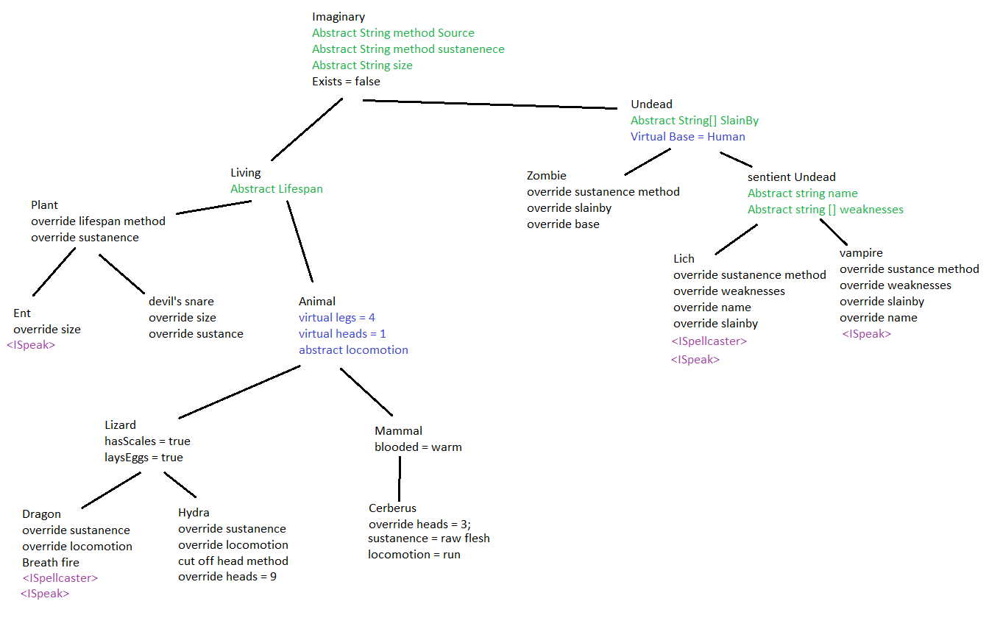

# zoo with interfaces
## Overview
This is the same zoo as before, now with the addition of interfaces. In particular, the ISpeak and ISpellcaster interfaces now force some disparate species far apart in the inheritance tree to share behavior.

## Use
This application is an instructive exercise with no practical purpose. The purpose was to use classes and inheritance to build a zoo of animals in a manner similar to biological classification of animals. Then, once the zoo was built, add at least two interfaces.

## Architecture
The design of this lab is a class inheritance tree. An outline is in the picture below.

As you can see, the base class is imaginary (NotExist in the actual code.) The other classes descend from that one base class. In particular, the important way today's work is different from yesterday's is the addition of interfaces. Dragons, Liches, Vampires, and Ents all have the ability to speak in most mythological references, so they gain the ISpeak interface. This requires all of those classes to contain a string Speak() method. Additionally, in mythology dragons and liches frequently are powerful magic users so they both are given the ISpellcaster interface, requiring that the developer give both classes a string UseMagic method. All of those new methods and interfaces do get tested.

#### Species
list of concrete species classes that can be instantiated
- Dragon
- Ent
- Cerberus
- Devil's Snare
- Hydra
- Lich
- Vampire
- Zombie

## Interfaces
There are two interfaces used: ISpeak and ISpellcaster. These interfaces connect behaviors of classes very disparate on the inheritance heirarchy.

- ISpeak is applied to Sentient_Undead, Dragon, and Ent. It requires there to be a Speak method that returns a string.
- ISpellcaster is applied to Dragon and Lich. It requires those classes to have a UseMagic method that returns a string.

Note: in both cases, the method returns a string. In order to actually do something useful with that information, another method has to be implemented. As an example, in the Program class their are two methods that accept an ISpeak/ISpellcaster and print out the result of the required methods to the console. This is an example of how to work with interfaces.

## Sources
Wikipedia provided information especially about dates of origin for mythological origin of the species.
Choices made about which mythological source is the origin of Dragon or Zombie or Hydra were sometimes fairly arbitrary and subjective opinions of the developer, not objective fact.

## version
2018-03-27 v1.0 Built off of zoo project with Interfaces implemented
2018-04-06 v1.1 Added methods that require interfaces and printed things to the console